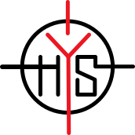

# hys-helsinki

**FI:** hys-helsinki on innokkaiden vapaahetoisen joukko, joka ylläpitää ja kehittää Helsingin yliopisto salamurhaajien (HYS) turnausjärjestelmää, Surmaa.

**EN**: hys-helsinki is a passionate group of volunteers developing and maintaining the tournament management system Surma (freely translated as "involuntary manslaughter under mitigating conditions" in Finnish) for Helsinki University's Society of Headhunters (HUSH).

🌐 [Nettisivut / Website](https://salamurhaajat.net)

📫 [Ota yhteyttä / Contact](mailto:surma@salamurhaajat.net)

 
